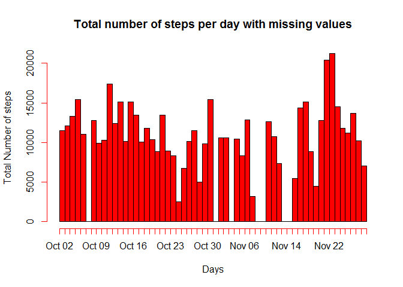
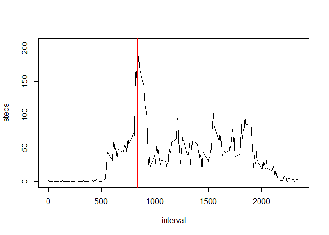
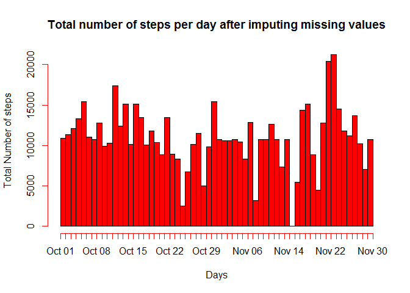
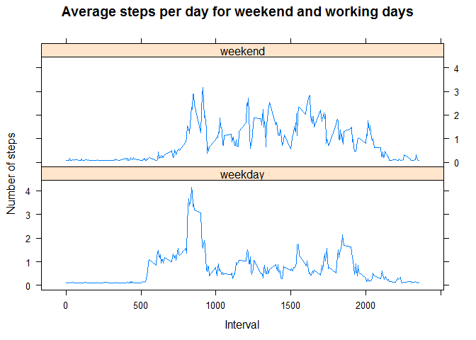

# Reproducible Research: Project 1
Muhidin M.  


## 1. Loading and preprocessing the data

```r
# downloading the data and viewing its summary statistics
download.file("https://d396qusza40orc.cloudfront.net/repdata%2Fdata%2Factivity.zip", destfile = "./data/activity.zip")
activity <- read.csv(unzip("./data/activity.zip", exdir = "./data"))
summary(activity)
```

```
##      steps                date          interval     
##  Min.   :  0.00   2012-10-01:  288   Min.   :   0.0  
##  1st Qu.:  0.00   2012-10-02:  288   1st Qu.: 588.8  
##  Median :  0.00   2012-10-03:  288   Median :1177.5  
##  Mean   : 37.38   2012-10-04:  288   Mean   :1177.5  
##  3rd Qu.: 12.00   2012-10-05:  288   3rd Qu.:1766.2  
##  Max.   :806.00   2012-10-06:  288   Max.   :2355.0  
##  NA's   :2304     (Other)   :15840
```


## 2. What is mean total number of steps taken per day?

```r
library(ggplot2)
# calculating the total number of steps for each day and making histogram of it.
totalstepsperday <- aggregate(steps~date,activity,sum)
hist(rep(as.Date(totalstepsperday$date), totalstepsperday$steps), breaks = length(totalstepsperday$date), freq = T, col = "red", xlab = "Days", ylab = "Total Number of steps", main = "Total number of steps per day with missing values")
```

<!-- -->

```r
# Mean of the total number of steps take per day
mean(totalstepsperday$steps, na.rm = T)
```

```
## [1] 10766.19
```

```r
# Median of the total number of steps take per day
median(totalstepsperday$steps, na.rm = T)
```

```
## [1] 10765
```

```r
# Total daily number of steps
sum(totalstepsperday$steps)
```

```
## [1] 570608
```


## 3. What is the average daily activity pattern?

```r
# Calculating the average number of steps and making time series plot
y <- aggregate(steps~interval,activity,mean)
with(y, plot(interval, steps, type = "l"))
# identifying the 5-minute interval that contain the max number of steps
max_point <- y[which.max(y$steps),]$interval
max_point
```

```
## [1] 835
```

```r
# highlighting the maximum number of steps with vertical redline
abline(v = max_point, col = "red")
```

<!-- -->

## 4. Imputing missing values

```r
# counting the number of rows with missing values
sum(is.na(activity))
```

```
## [1] 2304
```

```r
# Creating a new complete dataset after imputing missing values with means 
activity$steps[is.na(activity$steps)] = mean(activity$steps, na.rm=TRUE)
# Ensuring that there no missing values in the imputed dataset by counting NA values.
sum(is.na(activity))
```

```
## [1] 0
```

```r
# calculating the total number of steps for each day
imputedtotalstepsperday <- aggregate(steps~date,activity,sum)
# Generating histogram of the total number of steps taken each dya
hist(rep(as.Date(imputedtotalstepsperday$date), imputedtotalstepsperday$steps), breaks = length(imputedtotalstepsperday$date), freq = T, col = "red", xlab = "Days", ylab = "Total Number of steps", main = "Total number of steps per day after imputing missing values")
```

<!-- -->

```r
# Mean of the total number of steps take per day after imputation
mean(imputedtotalstepsperday$steps)
```

```
## [1] 10766.19
```

```r
# Median of the total number of steps take per day after imputation
median(imputedtotalstepsperday$steps)
```

```
## [1] 10766.19
```

```r
# total daily number of steps after imputation
sum(imputedtotalstepsperday$steps)
```

```
## [1] 656737.5
```
Imputing the missing values has dramatically increased the total daily number of steps from **570608** to **656737.5**, as can be seen in steps 2 and 4. However, the mean and median values of the total number of steps before and after imputation remain almost unaffected with slight reduction of median value. This can be checked by comparing the corresponding values computed steps 2 and 4.

## 5. Are there differences in activity patterns between weekdays and weekends?

```r
library(lattice)
y <- activity
# Changing the date variable into weekday factor variable of two lavels: weekend & weekday
y$weekday <- factor(ifelse(weekdays(as.Date(y$date)) %in% c("Saturday", "Sunday"), "weekend", "weekday"))
# Averaging number of steps over the interval and date/weekday
y <- setNames(aggregate(y$steps, by = list(y$interval, y$weekday), mean), c("interval", "weekday", "steps"))
# Making time series plots of the average steps per day for weekend, weekday days 
with(y, xyplot(steps/50 ~ interval |weekday, layout = c(1, 2), type = "l", xlab = "Interval", ylab = "Number of steps", main = "Average steps per day for weekend and working days"))
```

<!-- -->
